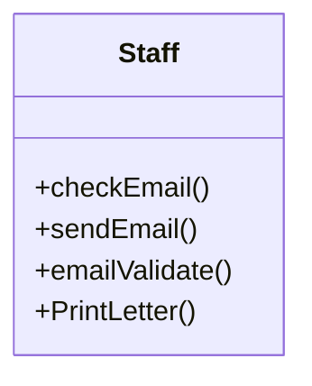
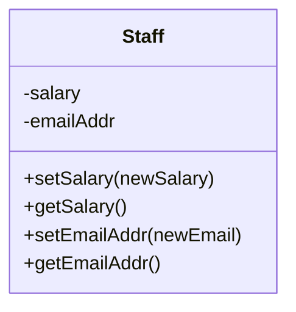

# Cohesion

Cohesion(凝集性）は、ソフトウェア設計においてコードの品質を測る指標です。

凝集性が高いほど、推奨される品質の高いコードになります。

凝集性が高いコードはそのコードの意図するふるまいにのみ焦点が当たっています。

たとえば、






Rimworldのコードで凝集性を学びます。

機能的凝集、逐次的凝集の例として、Pawn＿Ownershipを見てみましょう。

機能的凝集とは、クラスやメソッドが単一の機能や目的に集中していることを指します。

逐次的凝集とは、2つ以上の機能が含まれているが、メソッド内の各ステップが前のステップの出力を次のステップの入力として使用する場合に見られる凝集の形式です。以下のコード例では、ExposeData メソッドが逐次的凝集の良い例です。


通信的凝集とは同じデータを扱う要素が集められた状態です。データに関する操作が一つのモジュールに集められている場合です。

```csharp
public void ExposeData()
{
  Building_Grave refee = AssignedGrave;
  Building_Throne refee2 = AssignedThrone;
  Building refee3 = AssignedMeditationSpot;
  Scribe_References.Look(ref intOwnedBed, "ownedBed");
  Scribe_References.Look(ref refee3, "assignedMeditationSpot");
  Scribe_References.Look(ref refee, "assignedGrave");
  Scribe_References.Look(ref refee2, "assignedThrone");
  AssignedGrave = refee;
  AssignedThrone = refee2;
  AssignedMeditationSpot = refee3;
  if (Scribe.mode != LoadSaveMode.PostLoadInit)
  {
    return;
  }
  if (intOwnedBed != null)
  {
    CompAssignableToPawn compAssignableToPawn = intOwnedBed.TryGetComp<CompAssignableToPawn>();
    if (compAssignableToPawn != null && !compAssignableToPawn.AssignedPawns.Contains(pawn))
    {
      Building_Bed newBed = intOwnedBed;
      UnclaimBed();
      ClaimBedIfNonMedical(newBed);
    }
  }
  if (AssignedGrave != null)
  {
    CompAssignableToPawn compAssignableToPawn2 = AssignedGrave.TryGetComp<CompAssignableToPawn>();
    if (compAssignableToPawn2 != null && !compAssignableToPawn2.AssignedPawns.Contains(pawn))
    {
      Building_Grave assignedGrave = AssignedGrave;
      UnclaimGrave();
      ClaimGrave(assignedGrave);
    }
  }
  if (AssignedThrone != null)
  {
    CompAssignableToPawn compAssignableToPawn3 = AssignedThrone.TryGetComp<CompAssignableToPawn>();
    if (compAssignableToPawn3 != null && !compAssignableToPawn3.AssignedPawns.Contains(pawn))
    {
      Building_Throne assignedThrone = AssignedThrone;
      UnclaimThrone();
      ClaimThrone(assignedThrone);
    }
  }
}

```

```csharp
public bool UnclaimBed()
{
  if (OwnedBed == null)
  {
    return false;
  }
  OwnedBed.CompAssignableToPawn.ForceRemovePawn(pawn);
  OwnedBed = null;
  return true;
}
```
