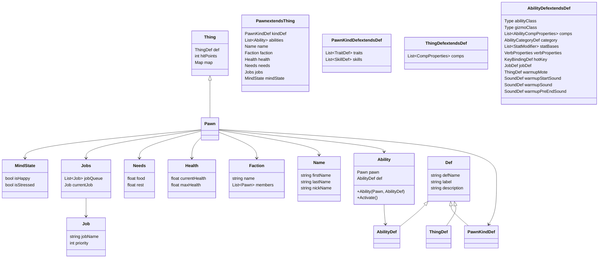

# Pawn

Pawn クラスは、ゲーム内のキャラクターを表すクラスです。以下に、Pawn クラスの概要とその関連クラスを説明します。

主なプロパティとメソッド
PawnKindDef kindDef: キャラクターの種類を定義するオブジェクト。
List<Ability> abilities: キャラクターが持つ能力のリスト。
Name name: キャラクターの名前。
Faction faction: キャラクターが所属する派閥。
Health health: キャラクターの健康状態。
Needs needs: キャラクターのニーズ（食事、休息など）。
Jobs jobs: キャラクターのジョブ（仕事）管理。
MindState mindState: キャラクターの精神状態。

