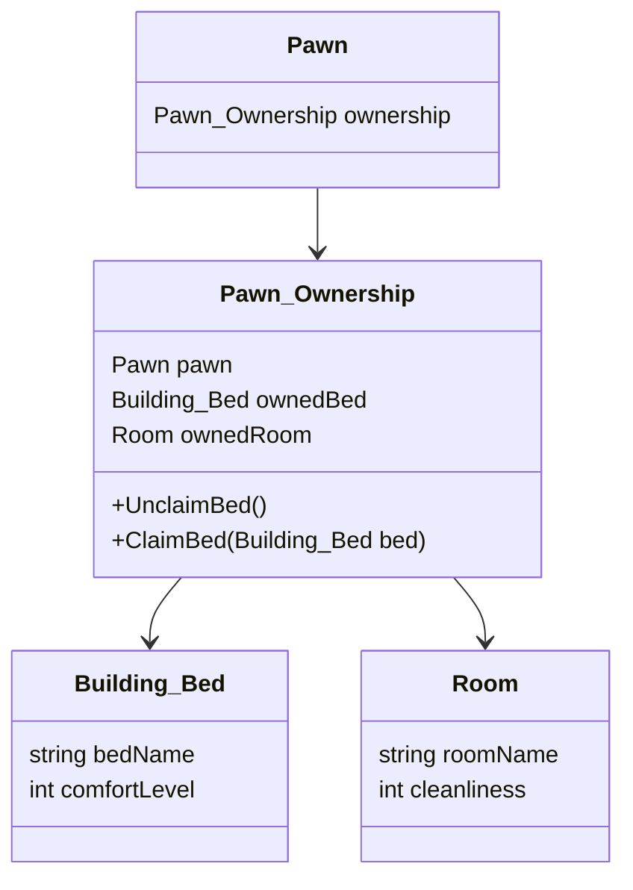

# Pawn Ownership

Pawn_Ownership クラスは、キャラクター（Pawn）の所有権に関連する情報を管理するためのクラスです。これには、キャラクターが所有するベッドや部屋などの情報が含まれます。

主なプロパティとメソッド
Pawn pawn: この所有権情報が関連付けられているキャラクター。
Building_Bed ownedBed: キャラクターが所有するベッド。
Room ownedRoom: キャラクターが所有する部屋。

