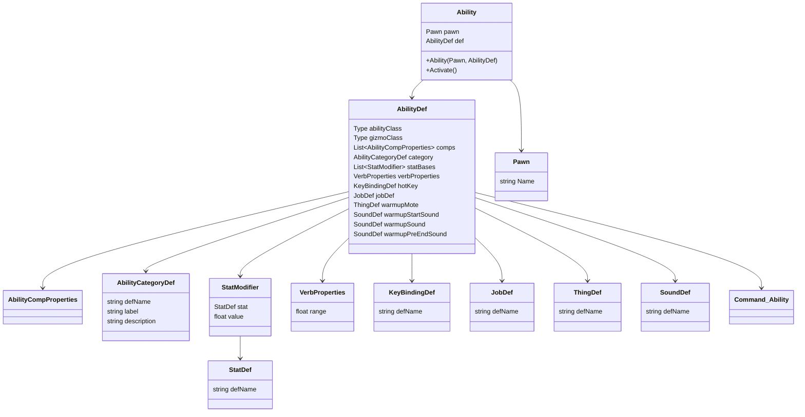

# Rimworld Decompiled


## Ability

Ability（能力）はAttackなどのキャラクターの能力です。

主にAbilityとAbilityDefで構成されています。

AbilityクラスとAbilityDefクラスの関係は、AbilityDefがAbilityの定義を提供し、Abilityがその定義に基づいて動作するというものです。

Abilityは能力の発動主体であるPawnへの参照を持っています。



```
public class Ability
{
    public Pawn pawn;
    public AbilityDef def;

    public Ability(Pawn pawn, AbilityDef def)
    {
        this.pawn = pawn;
        this.def = def;
        Initialize();
    }

    private void Initialize()
    {
        // defのプロパティを使用して初期化
        VerbProperties verbProps = def.verbProperties;
        List<StatModifier> statModifiers = def.statBases;
        // その他の初期化処理
    }

    public void Activate()
    {
        // defのプロパティに基づいて能力を発動
        if (def.warmupStartSound != null)
        {
            // サウンドを再生
        }
        // その他の発動処理
    }
}
```
