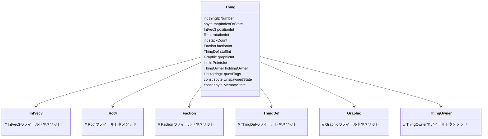

```mermaid

classDiagram
    class Thing {
        int thingIDNumber
        sbyte mapIndexOrState
        IntVec3 positionInt
        Rot4 rotationInt
        int stackCount
        Faction factionInt
        ThingDef stuffInt
        Graphic graphicInt
        int hitPointsInt
        ThingOwner holdingOwner
        List~string~ questTags
        const sbyte UnspawnedState
        const sbyte MemoryState
    }

    class IntVec3 {
        // IntVec3のフィールドやメソッド
    }

    class Rot4 {
        // Rot4のフィールドやメソッド
    }

    class Faction {
        // Factionのフィールドやメソッド
    }

    class ThingDef {
        // ThingDefのフィールドやメソッド
    }

    class Graphic {
        // Graphicのフィールドやメソッド
    }

    class ThingOwner {
        // ThingOwnerのフィールドやメソッド
    }

    Thing --> IntVec3
    Thing --> Rot4
    Thing --> Faction
    Thing --> ThingDef
    Thing --> Graphic
    Thing --> ThingOwner
```
