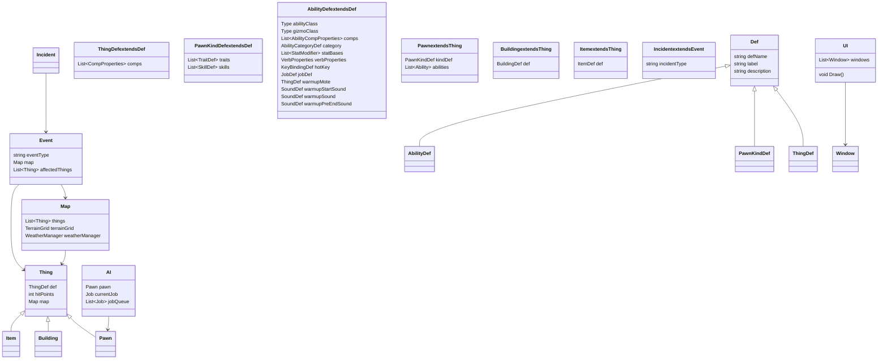

# Verse

Verse は、ゲーム「RimWorld」の基盤となるフレームワークであり、ゲームのロジック、データ構造、イベントシステムなどを提供します。以下に、Verse の全体像を説明します。

主なコンポーネント
データ定義 (Defs):

ゲーム内のアイテム、能力、建物、キャラクターなどのデータ定義を管理します。これには、ThingDef、PawnKindDef、AbilityDef などが含まれます。
エンティティ (Things):

ゲーム内の物理的なオブジェクトを表します。これには、Pawn（キャラクター）、Building（建物）、Item（アイテム）などが含まれます。
マップ (Map):

ゲームのプレイフィールドを管理します。地形、天候、時間の経過などを含みます。
イベントシステム (Events):

ゲーム内で発生するイベントやインシデントを管理します。これには、レイド、天候の変化、キャラクターの行動などが含まれます。
AI (AI):

キャラクターや敵の行動を制御する人工知能システムです。これには、パスファインディング、目標設定、行動決定などが含まれます。
ユーザーインターフェース (UI):

プレイヤーとゲームのインタラクションを管理します。これには、メニュー、インベントリ、ステータス表示などが含まれます。

